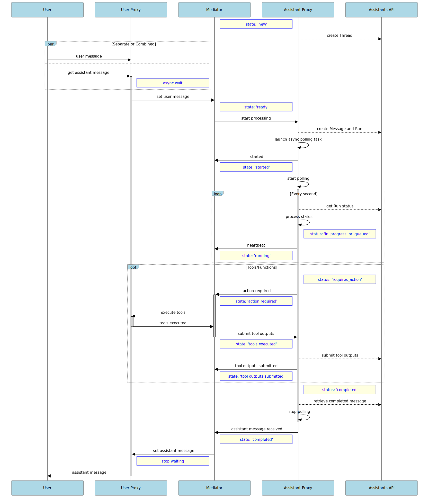

# Toolkit for building resilient, future-ready Assistants API integrations

This is a pilot toolkit for building well-designed, resilient Python-based integrations with OpenAI's Assistants API, built to withstand the fast-evolving AI technology landscape. 

The deisgn decouples the internal and external functionality related to the integration, using a Mediator (based on a state-machine) in the middle to orchestrate a "scripted interaction" at the boundary of the system. This design allows the system to stay flexible and evolve with ease, accomodating future external and internal changes. It can also be used for other similar API integrations.

## Introduction

The Assistants API allows clients to create customized assistants and run complex conversations following a 
sequence of steps (see [OpenAI Assistants documentation](https://platform.openai.com/assistants)). The interactions are one-way, from the client to the OpenAI API, as OpenAI does not make call-backs or send notifications. When building integrations with the Assistants API, it is important to follow software engineering best practices, to make sure our systems are future-ready for the rapid advancements in the AI technology field. 

Here are the main ideas behind the design of this toolkit:

1. Maintain an **end-to-end perspective** of the flows that have assistants as particpants; the integration with the external API is just one piece of the puzzle. One needs full visibility into the end-to-end execution of the AI-powered workflows.


2. The conversation between the client system and the Assistants API follows a **pre-defined interaction script**, modeled as a **state machine**. The main actors are a **User Proxy** and an **Assistant Proxy**, interacting indirectly under the supervision of a **Mediator** who owns the interaction script.


3. The **Assistant Proxy** acts on behalf of the Assistant, managing the calls to the Assistants API (and having exclusivity in doing so), and interacting indirectly with the User Proxy via the Mediator. It becomes an **active player** in the client ecosystem, proxy-ing the passive remote Assistant.


4. **The User Proxy** acts on behalf of the user and other internal systems that require Assistants API integration, interacting indirectly with the Assistant Proxy via the Mediator and making supporting internal calls as needed (such as executing function tools registered with the assistant when instructed so by the Assistant, via the Mediator).

## Design

The diagram below shows how the User Proxy, Assistant Proxy and Mediator work together within the distributed overall ecosystem to implement a clean integration with the Assistants API:


The User Proxy initiates a conversation exchange through a prompt, and assists with function call execution as needed.

Once the conversation exchange is started, the Assistant Proxy makes regular calls to the Assistants API to check on the Run status (polling), and processes the return status accordingly, with the help of the Mediator. 

As mentioned earlier, the Mediator is implemented (formally or informally) as a state machine, with transitions as shown below:


The states are based on:

1. the external Assistant's Run status
2. the status of supporting internal calls, related to executing required actions

and provide an aggregate reflection of the overall execution rather than just the Assistant's progress.

The dotted-line transitions are allowed in case the "running" state is missed when polling the Assisstans API (which can happen when processing is faster than the polling interval, or when polling is delayed, like it may happen when the app is running in debug mode with break points).

The Mediator also publishes events related to the progress of the interaction, so that interested systems can subscribe and stay updated.

## Implementation Details

The sequence diagram below shows the detailed "scripted interaction" during a conversation exchange, orchestrated by the Mediator:



 There are two implementations for the Mediator:

- `MediatorBasic`, a plain Python implementation, that does not enforce pre-conditions for state transitions
- `MediatorStateMachine`, with all bells and whistle, using [transition](https://github.com/pytransitions/transitions), an excellent state machine implementation in Python.

## User Interface

Using the integration toolkit, one can build user interfaces with ease, through a clean integration with the User Proxy and optionally listen to events published by the Mediator. The included streamlit-based Chat App allows users to carry conversations with assistants, by providing their IDs. A test assistant configuration is included to deploy and use in order to showcase the available toolkit features. It is configured with 2 functions as tools, and function calls are displayed real time as part of the chat window during the conversation. See screenhot below:


In addition, also included is a separate streamlit page that allows users to browse past conversations and review logs (including function calls, and second-by-second polling status). It uses aggrid for table display. See screenhot below:


## Dependencies

Python 3.x (developed with 3.11)

streamlit~=1.29.0

streamlit-aggrid~=0.3.4

pydantic~=2.5.2

Pypubsub~=4.0.3

SQLAlchemy~=2.0.23

pandas~=2.1.4

openai~=1.3.8

yfinance~=0.2.33

transitions~=0.9.0

python-dotenv~=1.0.0

## Setup

### Code and dependencies

Clone this repository and use your favorite IDE to open it as a project:

```bash
git clone https://github.com/exponentis/openai-assistants-api-integration.git
```

Create a virtual environment, activate it and install dependencies:

```bash
cd openai-assistants-api-integration
pip install -r requirements.txt
```

### Configuration

Copy the coontents of the file `.env_sample` to a new file named `.env` and update the `OPEN_API_KEY` variable (see 
[https://platform.openai.com/api-keys](https://platform.openai.com/api-keys))

### Assistant

Run `assistant_setup.py` to create the sample assistant:

```python
python assistant_setup.py
```
Capture the assistent ID (either from your OpenAI gpt+ account, or from the terminal after running the above script) and 
update the `ASSISTANT_ID` variable in the `.env` file

### Database

The project uses sqlite with a folder called `dbstorage` for storage. Run the `db_setup.py` script to create the database 
and the schema:

```python
python db_setup.py
```

## Running the app

Open the chat page to start conversations with assistants by running:

```python
streamlit run streamlit-chat.py
```

The page loads the Assistant ID from `.env` as default; it can be overriden before starting a new 
conversation.

To open the history page and browse data stored in the database, run:

```python
streamlit run streamlit-history.py
```


